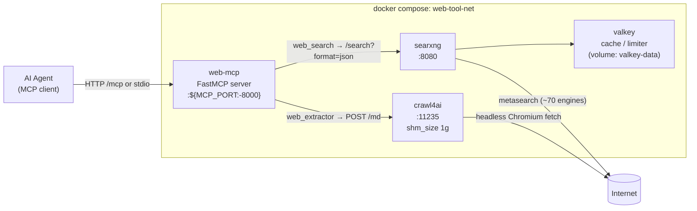
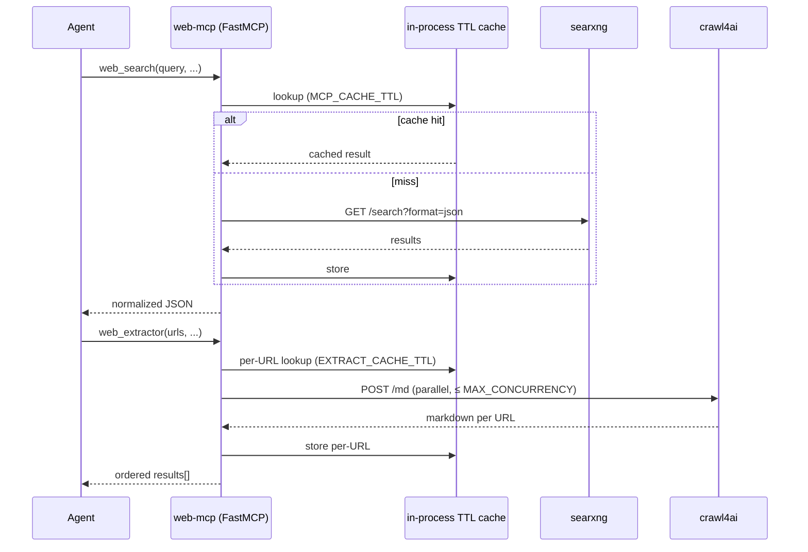

# mcp-web-tool

A single `docker compose` stack that gives AI agents two web tools over MCP — fully self-hosted, no third-party API keys.

- **`web_search`** — web search via a self-hosted [SearXNG](https://docs.searxng.org/) metasearch instance.
- **`web_extractor`** — fetch one or more URLs and return clean Markdown via [Crawl4AI](https://docs.crawl4ai.com/) (headless-browser crawler).

The MCP server is a thin [FastMCP](https://github.com/jlowin/fastmcp) wrapper that calls SearXNG and Crawl4AI over the internal Docker network, normalizes their output, and adds a small TTL cache on top of each service's own caching.

---

## Features

- **Two MCP tools out of the box** — `web_search` (SearXNG-backed) and `web_extractor` (Crawl4AI-backed, returns Markdown), exposed at `http://<host>:${MCP_PORT}/mcp`.
- **Self-hosted, no API keys** — SearXNG aggregates ~70 search engines; Crawl4AI uses a bundled headless Chromium. Nothing leaves your network unless the underlying services fetch it.
- **One-command install** — `curl … | bash` clones the repo, checks prerequisites, generates secrets, and prints next steps. Idempotent and safe to re-run.
- **Transport flexible** — Streamable HTTP by default (`MCP_TRANSPORT=http`) for remote/multi-agent use, or stdio (`MCP_TRANSPORT=stdio`) for a single local client.
- **Layered caching** — Valkey backs SearXNG's limiter/cache; the MCP layer adds an in-process TTL cache (`MCP_CACHE_TTL`, `EXTRACT_CACHE_TTL`) on top.
- **Parallel extraction** — `web_extractor` fans out up to `MAX_CONCURRENCY` (default `5`) URLs per call, preserves input order, returns per-URL status.
- **FastAPI dev playground** — `make playground` boots a one-shot FastAPI app off the same image that imports the exact tool impls (`POST /search`, `POST /extract`, Swagger at `/docs`). Lets you exercise the tools from `curl` without an MCP client.
- **Pinnable images** — `VALKEY_IMAGE`, `SEARXNG_IMAGE`, `CRAWL4AI_IMAGE` in `.env` for reproducible deploys.
- **Convenience `make` targets** — `make up | down | logs | ps | smoke | playground | clean`.

---

## How to Use

### Requirements

- Docker Engine + `docker compose` v2 plugin
- `git` (for the curl-pipe installer)
- Free host ports `8080` (SearXNG), `11235` (Crawl4AI), `8000` (MCP) — `install.sh` warns about conflicts.

### Install — one-liner (recommended)

```bash
curl -fsSL https://github.com/datvietvac-techhub/agent-web-tool-mcp/releases/latest/download/install.sh | bash
```

The script clones the repo to `~/.local/share/mcp-web-tool` (override with `--dir <path>`), runs prerequisite checks, creates `.env`, and generates a random `SEARXNG_SECRET`. It does **not** start containers — that's `make up`.

Forward flags after `--`:

```bash
curl -fsSL https://github.com/datvietvac-techhub/agent-web-tool-mcp/releases/latest/download/install.sh \
  | bash -s -- --dir /opt/mcp-web-tool --pull
```

Pin to a specific release by swapping `latest` for a tag (e.g. `v1`):

```bash
curl -fsSL https://github.com/datvietvac-techhub/agent-web-tool-mcp/releases/download/v1/install.sh | bash
```

| flag | purpose |
|---|---|
| `--dir <path>` | target dir for the clone (default `~/.local/share/mcp-web-tool`) |
| `--pull` | `docker compose pull` upstream images right after bootstrap |
| `--skip-checks` | skip port / daemon prerequisite checks |
| `-h, --help` | show help |

If `docker` needs `sudo` on your box, prefix with `sudo`, or add yourself to the `docker` group:

```bash
sudo usermod -aG docker "$USER" && newgrp docker
```

### Install — manual clone

```bash
git clone https://github.com/datvietvac-techhub/agent-web-tool-mcp.git
cd agent-web-tool-mcp
./install.sh        # bootstrap only
make up             # start the stack
make smoke          # verify endpoints
```

`make install` is the all-in-one equivalent: bootstrap + `compose up -d --build` + smoke. First `make up` pulls the Crawl4AI image (~GB, includes Chromium) — budget a couple of minutes.

### Manual install (no script)

```bash
cp .env.example .env
echo "SEARXNG_SECRET=$(openssl rand -hex 32)" >> .env
docker compose up -d --build
docker compose ps        # wait until searxng + crawl4ai are "healthy"
```

### Day-to-day (`make`)

```
make bootstrap   # ./install.sh only (prereqs, .env, secret) — no compose up
make install     # one-shot: bootstrap + up + smoke (forward flags with ARGS="--pull")
make up          # start              make down     # stop (keeps cache volume)
make restart     # restart            make ps       # status
make logs        # tail logs          make smoke    # re-run endpoint smoke tests
make build       # rebuild web-mcp    make pull     # refresh upstream images
make playground  # run the FastAPI dev API (alias: make play)
make secret      # print a fresh SEARXNG_SECRET value
make clean       # stop + remove the valkey cache volume
```

### Smoke tests

```bash
# SearXNG JSON API
curl -s "http://localhost:8080/search?q=anthropic+claude&format=json" | jq '.results[0]'

# Crawl4AI markdown endpoint
curl -s -X POST http://localhost:11235/md \
  -H 'Content-Type: application/json' \
  -d '{"url":"https://example.com","f":"fit"}' | jq '.markdown'

# MCP server: inspect tools
npx @modelcontextprotocol/inspector       # then connect to http://localhost:${MCP_PORT:-8000}/mcp
```

### Connect an agent

The MCP server listens on `http://<host>:${MCP_PORT}/mcp` (Streamable HTTP) — `MCP_PORT` defaults to `8000`.

Claude Code:

```bash
claude mcp add --transport http web-tool http://localhost:8000/mcp
```

Any MCP client config (Hermes, etc.):

```json
{
  "mcpServers": {
    "web-tool": { "transport": "http", "url": "http://localhost:8000/mcp" }
  }
}
```

For a single local client launching the server as a subprocess, set `MCP_TRANSPORT=stdio` in `.env` and point the client at `python mcp/server.py` (or `docker compose run`).

### MCP tools

Tool impls live in [`mcp/tools.py`](mcp/tools.py) and are shared with the dev playground.

#### `web_search`

| param | type | default | notes |
|---|---|---|---|
| `query` | string | required | search query |
| `num_results` | int | `10` | clamped to `1..50` |
| `categories` | string | `"general"` | SearXNG category: `general`, `news`, `science`, `it`, `images`, … |
| `language` | string | `"auto"` | `"en"`, `"vi"`, …; `"auto"` lets SearXNG decide |
| `time_range` | string \| null | `null` | `"day"`, `"week"`, `"month"`, `"year"` |

Returns:

```json
{
  "query": "...",
  "results": [
    { "title": "...", "url": "https://...", "snippet": "...", "engine": "...", "score": 1.0 }
  ],
  "answers": [],
  "suggestions": ["..."],
  "number_of_results": 12345
}
```

Results are de-duplicated by normalized URL and truncated to `num_results`. Cached in-process for `MCP_CACHE_TTL` seconds (default `300`). On failure the dict includes an `"error"` key and `"results": []`.

#### `web_extractor`

| param | type | default | notes |
|---|---|---|---|
| `urls` | string \| list[string] | required | one URL or a list — max **20** per call |
| `mode` | string | `"fit"` | `fit` (pruned main content), `raw` (full page), `bm25` / `llm` (relevance-filtered — requires `query`) |
| `query` | string \| null | `null` | focus query for `bm25` / `llm` mode |
| `bypass_cache` | bool | `false` | skip the local cache and ask Crawl4AI to re-fetch |

Returns:

```json
{
  "results": [
    {
      "url": "https://...",
      "status": "ok",
      "markdown": "# Heading\n...",
      "word_count": 1234,
      "error": "..."
    }
  ]
}
```

Order matches the input URL list. URLs are fetched in parallel up to `MAX_CONCURRENCY`. Cached for `EXTRACT_CACHE_TTL` seconds (default `1800`).

### Dev playground (FastAPI)

Useful for poking the tools from `curl` without wiring up an MCP client. Not in `docker-compose.yml` — run on demand as a one-shot container off the existing `web-mcp` image (the main stack must already be up).

```bash
make up           # if not already running
make playground   # alias: make play
```

Listens on `http://localhost:${PLAYGROUND_PORT}` (default `8001`). Ctrl-C stops it; container is removed automatically.

| method | path | body | description |
|---|---|---|---|
| GET | `/healthz` | — | liveness probe → `{"ok": true}` |
| POST | `/search` | `SearchReq` | calls `web_search_impl`, same shape as the MCP tool |
| POST | `/extract` | `ExtractReq` | calls `web_extractor_impl`, same shape as the MCP tool |

Bodies mirror the tool signatures one-for-one. Swagger UI is auto-generated at `/docs`, ReDoc at `/redoc`.

> **Dev-only.** No auth, verbose errors, accepts arbitrary URLs. Don't expose `PLAYGROUND_PORT` publicly.

### Configuration

Everything is set via `.env` (see [`.env.example`](.env.example)):

| var | default | purpose |
|---|---|---|
| `SEARXNG_SECRET` | _(required)_ | HMAC signing key for SearXNG — not an API key |
| `CRAWL4AI_API_TOKEN` | _(empty)_ | optional bearer token if Crawl4AI is locked down |
| `MCP_TRANSPORT` | `http` | `http` (streamable-http) or `stdio` (subprocess) |
| `MCP_PORT` | `8000` | host port for the MCP server (also used for `make smoke`) |
| `PLAYGROUND_PORT` | `8001` | host port for `make playground` |
| `MCP_CACHE_TTL` | `300` | `web_search` cache TTL in seconds (`0` disables) |
| `EXTRACT_CACHE_TTL` | `1800` | `web_extractor` cache TTL in seconds (`0` disables) |
| `REQUEST_TIMEOUT` | `30` | SearXNG request timeout (s) |
| `EXTRACT_TIMEOUT` | `60` | Crawl4AI request timeout (s) |
| `MAX_CONCURRENCY` | `5` | parallel Crawl4AI requests per `web_extractor` call |
| `VALKEY_IMAGE` / `SEARXNG_IMAGE` / `CRAWL4AI_IMAGE` | `:latest` | pin image versions for reproducible installs |

After changing `MCP_PORT`, run `make restart` (not just `up`) so the new host-port mapping takes effect.

`SEARXNG_SECRET` is **not** an API key — nothing sends it. SearXNG uses it server-side to sign image-proxy URLs (HMAC) and internal tokens; it just needs to be random and stable. `install.sh` generates it; the SearXNG container won't start without one.

Search quality is tuned in [`searxng/settings.yml`](searxng/settings.yml) (engines enabled, weights, categories) — restart the `searxng` service after editing.

### Stopping

```bash
docker compose down            # keep the Valkey cache volume
docker compose down -v         # also remove cached data
make clean                     # equivalent to `down -v`
```

---

## Architecture

Four services on a single bridge network (`web-tool-net`). Agents only ever talk to `web-mcp`; the other services are internal.



### Service responsibilities

| service | image | port | role |
|---|---|---|---|
| `valkey` | `valkey/valkey:8-alpine` | — (internal) | cache + rate-limiter backend for SearXNG; data persisted to the `valkey-data` volume |
| `searxng` | `searxng/searxng:latest` | `8080` | metasearch frontend; JSON API enabled; settings in `searxng/settings.yml` |
| `crawl4ai` | `unclecode/crawl4ai:latest` | `11235` | headless-browser crawler; exposes `/md` and `/crawl`; `shm_size: 1g` avoids Chromium crashes |
| `web-mcp` | built from [`mcp/Dockerfile`](mcp/Dockerfile) | `${MCP_PORT:-8000}` | FastMCP server; tool impls in [`mcp/tools.py`](mcp/tools.py); shared with the FastAPI playground |

On demand (not in compose), `make playground` runs the same `web-mcp` image with [`mcp/playground.py`](mcp/playground.py) as entrypoint, joining `web-tool-net` via `compose run` so it reaches `searxng` and `crawl4ai` by service name.

### Request flow



### Notes / gotchas

- **SearXNG JSON API must be enabled** — `searxng/settings.yml` already lists `json` under `search.formats`. Without it the API returns `403`.
- **`SEARXNG_SECRET` is required** — the SearXNG container fails to start without it; compose errors out early if unset.
- **Limiter is disabled** (`limiter: false`) because the instance is only reachable inside the compose network. Enable and configure it if you ever expose `8080` publicly.
- **Pin the Crawl4AI image in production** — set `CRAWL4AI_IMAGE=unclecode/crawl4ai:<version>` in `.env`; its `/md` request shape has shifted between releases. If `web_extractor` ever returns empty markdown, check `http://localhost:11235/playground` to see the current request shape.
- **`shm_size: 1g`** on the `crawl4ai` service avoids Chromium crashes on large pages.

---

## How to Contribute

### Project layout

```
.
├── docker-compose.yml      # 4-service stack
├── install.sh              # bootstrap (curl-pipe + in-repo modes)
├── Makefile                # make up/down/logs/playground/smoke/...
├── .env.example            # all tunables, copied to .env by install.sh
├── mcp/                    # the only service we build
│   ├── Dockerfile
│   ├── server.py           # FastMCP entrypoint, registers tools
│   ├── tools.py            # web_search_impl + web_extractor_impl (shared)
│   ├── playground.py       # FastAPI dev app (re-uses tools.py)
│   └── requirements.txt
├── searxng/
│   └── settings.yml        # engines, categories, formats, limiter
└── docs/
```

### Local dev loop

```bash
git clone https://github.com/datvietvac-techhub/agent-web-tool-mcp.git
cd agent-web-tool-mcp
./install.sh                         # one-time
make up                              # start the stack
make playground                      # iterate against POST /search, POST /extract

# after editing mcp/*.py:
make build && make restart           # rebuild the web-mcp image and restart
make logs                            # tail all services
```

For pure tool-impl changes you can also run `mcp/playground.py` directly against the running stack — it imports the same `web_search_impl` / `web_extractor_impl`, so behavior matches the MCP server exactly.

### Coding conventions

- **Python**: target the version pinned in [`mcp/Dockerfile`](mcp/Dockerfile). Keep tool impls (`mcp/tools.py`) free of MCP- or FastAPI-specific imports so both `server.py` and `playground.py` can share them.
- **Tool contracts are stable** — return shapes for `web_search` / `web_extractor` are part of the public surface; bump the README table when you change them.
- **Failures are values, not exceptions** — both tools return a dict with an `error` field on failure (and `results: []` / `status: "error"` per URL). Don't raise from tool entrypoints.
- **Caching keys** must include every input that affects the response (query, categories, language, time_range, mode, query for bm25/llm, etc.).
- **Shell scripts** are bash-only, `set -euo pipefail`, and must stay idempotent. Test both in-repo and curl-pipe paths when touching `install.sh`.
- **Compose**: don't add new host-port bindings without an env-var default and a note in `.env.example` + the config table.

### Submitting changes

1. Fork and create a feature branch off `main`.
2. Run `make build && make restart && make smoke` before pushing — all three endpoints must return `ok` / `2xx`.
3. If your change touches a tool's request/response shape, update both the README table and any clients you know of.
4. Open a PR with:
   - what changed and why (one paragraph is fine),
   - `make smoke` output, or a manual `curl` against the relevant endpoint,
   - any new env vars added to `.env.example`.
5. Avoid drive-by reformatting; keep diffs focused.

### Reporting issues

When filing a bug, include:

- output of `docker compose ps` and `docker compose version`,
- relevant logs: `make logs` (or `docker compose logs <service>`),
- `.env` with `SEARXNG_SECRET` and `CRAWL4AI_API_TOKEN` redacted,
- exact tool call (params) and the response you got.
