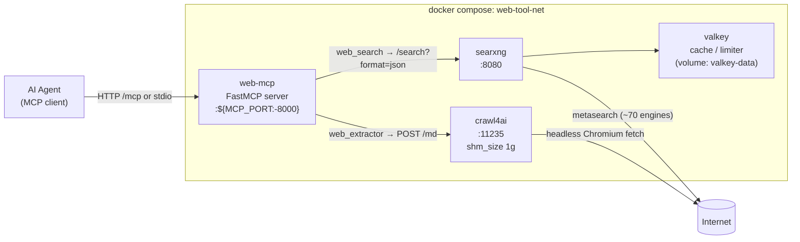
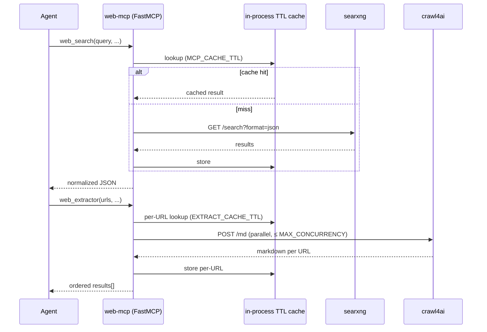

# Architecture

> Internal Docker service, container, network, and volume names (`web-mcp`, `web-tool-net`, `web-tool-{valkey,searxng,crawl4ai}`, `valkey-data`) retain the project's previous slug (`agent-web-tool-mcp` / `mcp-web-tool`) for deployment compatibility. They will be unified to the `mcp-web-tools-*` prefix in a future major release.

Four services run on a single bridge network (`web-tool-net`). Agents only ever talk to `web-mcp`; SearXNG, Crawl4AI, and Valkey are internal services and are not published to the host by default.

## Service responsibilities

| service | image | port | role |
|---|---|---|---|
| `valkey` | `valkey/valkey:8-alpine` | — (internal) | cache + rate-limiter backend for SearXNG; data persisted to the `valkey-data` volume |
| `searxng` | `searxng/searxng:latest` | `8080` internal | metasearch frontend; JSON API enabled; settings in `searxng/settings.yml` |
| `crawl4ai` | `unclecode/crawl4ai:latest` | `11235` internal | headless-browser crawler; exposes `/md` and `/crawl`; `shm_size: 1g` avoids Chromium crashes |
| `web-mcp` | built from [`mcp/Dockerfile`](https://github.com/datvietvac-techhub/mcp-web-tools/blob/main/mcp/Dockerfile) | `${MCP_PORT:-8000}` host | FastMCP server; tool impls in [`mcp/tools.py`](https://github.com/datvietvac-techhub/mcp-web-tools/blob/main/mcp/tools.py); shared with the FastAPI playground |

On demand (not in compose), `make playground` runs the same `web-mcp` image with [`mcp/playground.py`](https://github.com/datvietvac-techhub/mcp-web-tools/blob/main/mcp/playground.py) as entrypoint, joining `web-tool-net` via `compose run` so it reaches `searxng` and `crawl4ai` by service name.

## Request flow

## Caching layers

There are **two** TTL caches in the path:

1. **MCP layer** (`mcp/tools.py`): in-process `cachetools.TTLCache`, keyed by the full tuple of input params. Sized 512 for `web_search`, 1024 for `web_extractor`. Disabled when `MCP_CACHE_TTL=0` / `EXTRACT_CACHE_TTL=0`.
2. **SearXNG / Crawl4AI**: each upstream maintains its own caches independently. SearXNG uses Valkey for limiter + result cache; Crawl4AI has internal page caches that `web_extractor`'s `bypass_cache=true` flag bypasses.

Cache keys must include every input that affects the response (query, categories, language, time_range, mode, focus query for bm25/llm). When adding a new param to a tool, update the cache key in [`mcp/tools.py`](https://github.com/datvietvac-techhub/mcp-web-tools/blob/main/mcp/tools.py) accordingly.

## Notes & gotchas

- **SearXNG JSON API must be enabled** — `searxng/settings.yml` already lists `json` under `search.formats`. Without it the API returns `403`.
- **`SEARXNG_SECRET` is required** — the SearXNG container fails to start without it; compose errors out early if unset.
- **Limiter is disabled** (`limiter: false`) because the instance is only reachable inside the compose network. Enable and configure it if you publish SearXNG outside that network.
- **Pin the Crawl4AI image in production** — set `CRAWL4AI_IMAGE=unclecode/crawl4ai:<version>` in `.env`; its `/md` request shape has shifted between releases. If `web_extractor` ever returns empty markdown, inspect Crawl4AI from inside the compose network.
- **URL protection boundary** — `web_extractor` does basic URL validation before calling Crawl4AI. Optional SSRF hardening (private-IP blocking, allow/deny lists, DNS safeguards) belongs in `mcp/url_policy.py` and is intentionally not mandatory for zero-config use.
- **`shm_size: 1g`** on the `crawl4ai` service avoids Chromium crashes on large pages.
- **Failures are values, not exceptions** — both tools return a dict with an `error` field on failure (and `results: []` / `status: "error"` per URL). Don't catch exceptions raised from tool entrypoints; there shouldn't be any.

The Excalidraw source for diagram editing is at [`docs/architecture.excalidraw`](https://github.com/datvietvac-techhub/mcp-web-tools/blob/main/docs/architecture.excalidraw). The Mermaid diagrams above are the canonical, rendered version used on this docs site and on GitHub.
